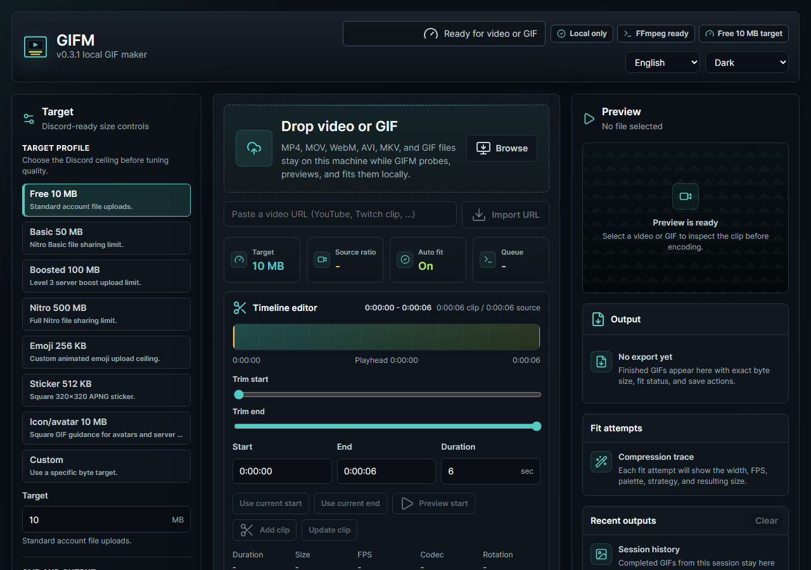

# GIFM


GIFM v0.3.1 is a local GIF maker and compressor for Discord-ready animated GIFs. It converts MP4, MOV, WebM, AVI, MKV, and existing GIF files with bundled FFmpeg, then retries width, FPS, and palette settings until the output fits the selected target.

## Features

- Discord Free 10 MB, Nitro Basic 50 MB, Full Nitro 500 MB, Emoji 256 KB, icon/avatar, and custom target presets.
- Video-to-GIF conversion from common video files.
- Existing GIF recompression through the same palette workflow.
- Output as animated GIF, APNG (Discord stickers), animated WebP (Discord-native, much smaller than GIF), muted MP4 (Discord autoplays inline), or animated AVIF (max compression).
- Multi-file batch submission through the same local queue and current preset.
- Timeline editor for long videos with exact timecodes, playhead start/end marking, saved GIF cuts, and export-one/export-all actions.
- Prepared source sessions so one long video can be staged once and reused for many GIF cuts without re-uploading it each time.
- Visual trim timeline with source duration, resolution, FPS, codec, and rotation metadata.
- Browser-side metadata/frame preflight for supported files, with automatic FFprobe fallback when local preview decode is unavailable.
- Auto-fit loop for width, frame rate, color count, duplicate-frame removal, nth-frame dropping, transparency rectangles, and optional duration trimming.
- Local preview, queued/running progress, cancellable jobs, FFmpeg log, exact output byte count, and download/open-output actions.
- Output suitability and attempt strategy copy that says whether the GIF fits the selected Discord target and which compression lever was used.
- Persisted settings, named presets, and recent outputs in browser storage.
- Dark-first premium workspace with compact runtime trust cues, calmer settings hierarchy, and advanced transforms grouped behind a disclosure surface.
- Keyboard-visible focus states, reduced-motion support, ARIA progress, and an output alt-text helper.
- Diagnostics panel with FFmpeg/FFprobe versions, platform info, source estimate, latest FFmpeg command, and copy/download JSON bundle.
- Save-as output flow using the browser file picker when available, with download fallback.
- Optional user-provided gifski backend for higher-quality encodes while keeping GIFM's bundled FFmpeg path as the default.

## Screenshot



## Run Locally

```powershell
npm install
npm run dev
```

Open the Vite URL shown in the terminal. The API runs on `http://127.0.0.1:4174`.

## Production Build

```powershell
npm run build
npm run preview
```

`npm run preview` serves the built app and API from `http://127.0.0.1:4174`.

## Portable Windows Package

```powershell
npm run package:portable
npm run package:smoke
```

The portable artifact is written to `release/GIFM-v<version>-win-x64/` and zipped beside it. It includes a desktop `GIFM.exe`, the built client, Express server, current Node runtime, production-only `node_modules` (devDependencies and non-Windows FFprobe binaries are pruned), bundled FFmpeg/FFprobe, caption font assets, the Microsoft Edge WebView2 bootstrapper, and a `start-gifm.cmd` compatibility wrapper. Launch `GIFM.exe` to open GIFM as a Windows desktop app with its local processing service managed in the background. To update a portable copy, replace the folder with a newly generated package.

GIFM's desktop shell requires the Microsoft Edge WebView2 Runtime, which ships with current Windows 11. If it is missing, `GIFM.exe` runs the bundled `MicrosoftEdgeWebview2Setup.exe` bootstrapper on first launch to install it (this needs an internet connection once); otherwise install the runtime from Microsoft and relaunch.

## Verify

```powershell
npm run typecheck
npm run build
npm run test:unit
npm run test:smoke
npm run test:ui
npm run package:portable
npm run package:smoke
```

The unit test suite (`npm run test:unit`) covers the pure encoding-strategy logic in `server/encoding.js`: auto-fit attempt stepping, settings parsing/clamping, target presets, square dimension locks, and protected-path retention matching.

The smoke test generates a small local MP4, uploads it to GIFM, waits for the job to finish, downloads the result, validates the GIF header, and checks that the file fits the configured byte target.
The UI smoke test serves the built app and verifies the default English interface renders through the shared string catalog.

## Bundled Font

Caption overlays render with the Anton typeface bundled under the SIL Open Font License 1.1 at `assets/fonts/` (license text in `assets/fonts/Anton-OFL.txt`).

## Headless CLI

Convert without the UI using the same local engine:

```powershell
npm run cli -- input.mp4 --target free --format gif --width 480 --out .
npm run cli -- --watch .\incoming --target nitro-basic --format webp --out .\gifs
```

Options: `--target`, `--format` (gif/apng/webp/mp4/avif), `--width`, `--fps`, `--duration`, `--start`, `--out`. The CLI starts the local server, submits the job, and writes the result to the output directory. `--watch <folder>` auto-converts new video/GIF files dropped into the folder until interrupted.

## Output Location

Generated GIFs are stored under `data/output/`. Uploaded sources, smoke artifacts, and temporary work files stay under `data/`; the directory is ignored by Git.

## Optional gifski Backend

GIFM does not bundle gifski. To enable it, install a gifski binary yourself and point GIFM at it before starting the app:

```powershell
$env:GIFM_GIFSKI_PATH = "C:\Tools\gifski.exe"
npm run dev
```

The Encoder setting then exposes `gifski` beside the default FFmpeg palette encoder. gifski is AGPL-licensed unless you use a commercial license, so verify the license before redistributing any package that includes or depends on it.

## Optional gifsicle Optimization

GIFM does not bundle gifsicle either. When a `gifsicle` binary is on `PATH` (or `GIFM_GIFSICLE_PATH` points at one), the "Optimize with gifsicle" setting runs a `gifsicle -O3` pass on each encode and uses lossy LZW compression (`--lossy`) as an additional auto-fit lever, which significantly improves the chance of hitting tight targets such as the 256 KB emoji ceiling. gifsicle runs as a separate process and is GPL-2.0-licensed; verify the license before redistributing a package that depends on it.

```powershell
$env:GIFM_GIFSICLE_PATH = "C:\Tools\gifsicle.exe"
npm run dev
```

## Right-Click "Make GIF with GIFM" (Windows)

The portable package includes opt-in `register-shell.ps1` and `unregister-shell.ps1`. Run `register-shell.ps1` from inside the portable folder (no administrator rights needed) to add a "Make GIF with GIFM" entry to the right-click menu for common video and GIF files; selecting it launches GIFM with that file staged for trimming and export. Run `unregister-shell.ps1` to remove it.

## Optional URL Import

Paste a video URL into the import field to download it with [yt-dlp](https://github.com/yt-dlp/yt-dlp). GIFM does not bundle yt-dlp; install it on `PATH` or point `GIFM_YTDLP_PATH` at the binary. Downloads are capped at the upload limit and staged as a prepared source for trimming and export.

```powershell
$env:GIFM_YTDLP_PATH = "C:\Tools\yt-dlp.exe"
npm run dev
```

## Local Safety Controls

GIFM binds to `127.0.0.1` by default and rejects non-local hosts unless `GIFM_ALLOW_REMOTE=1` is set on a trusted network. Uploads are limited to 20 GB by default and are checked before FFmpeg runs.

Optional environment controls:

```powershell
$env:GIFM_MAX_UPLOAD_MB = "20480"
$env:GIFM_DATA_MAX_MB = "25600"
$env:GIFM_DATA_MAX_AGE_HOURS = "24"
$env:GIFM_MAX_CONCURRENT_JOBS = "1"
$env:GIFM_OUTPUT_DIR = "D:\GIFM-output"
$env:GIFM_GIFSKI_PATH = "C:\Tools\gifski.exe"
npm run dev
```

Completed outputs, uploads, and temporary work files are pruned by age and total size so abandoned runs do not keep filling disk.
